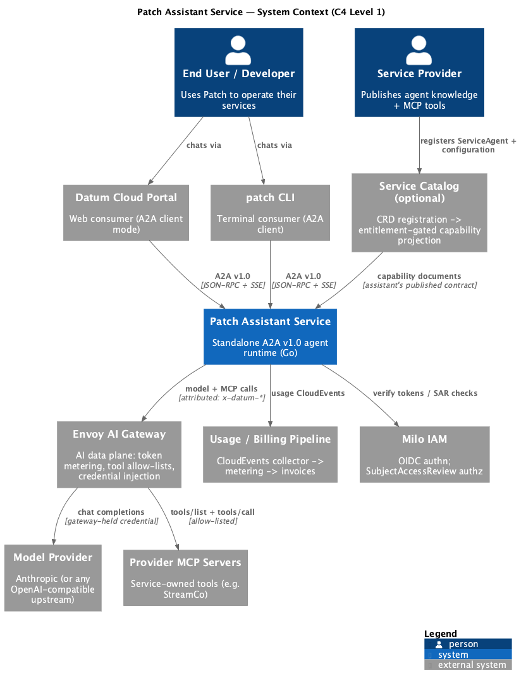
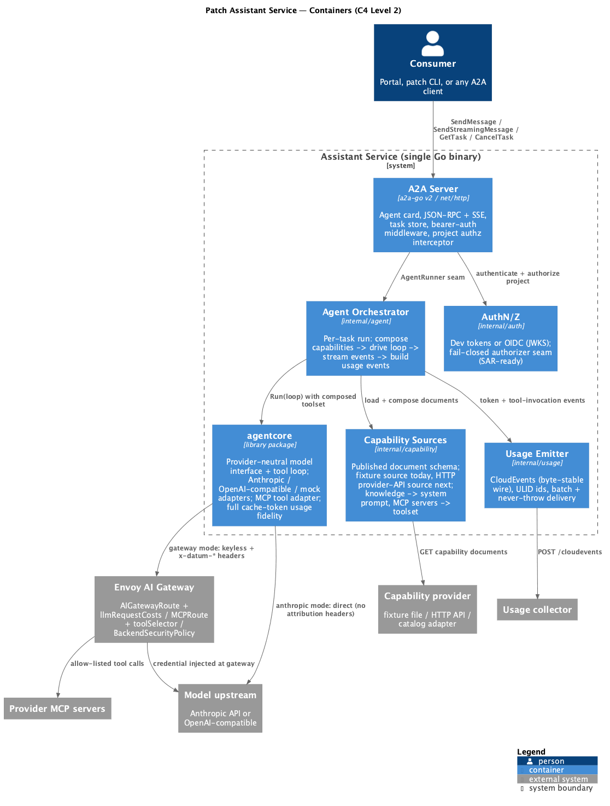

# Patch Assistant Service — Product & Architecture

**Status:** implemented (Go service, A2A v1.0) · **Owners:** Datum platform ·
**Companion:** [AI Agent Framework enhancement](https://github.com/datum-cloud/enhancements/tree/main/enhancements/platform/ai-agent-framework)
(the platform-side proposal; this document covers the assistant service itself).

## What this is

Patch is Datum Cloud's AI operator: a conversational agent that answers
questions and diagnoses problems using the **live capabilities of the
services a customer is entitled to**. This service is Patch's runtime —
a standalone backend that any consumer (the Cloud Portal, the `patch`
CLI, other agents) reaches over the open [A2A v1.0
protocol](https://a2a-protocol.org/).

Three product properties define it:

1. **Capability velocity** — service providers plug knowledge and tools
   in through *capability documents*; the assistant composes them per
   conversation. Adding a capability never means redeploying the
   assistant.
2. **Interoperability** — consumers integrate via A2A; providers expose
   tools via MCP. No proprietary Datum API on either side.
3. **Revenue integrity** — every model call and every provider tool
   invocation is metered and attributed (project, conversation, agent),
   and the AI data plane is designed so usage is counted **at a gateway
   the platform controls**, not on the honor system.

## Who it serves

| Audience | What they get |
|---|---|
| End users / developers | An operator that can *do things* with their services: "Diagnose pipeline p-1" runs the provider's own diagnostic tool and explains the result. |
| Service providers | A distribution channel: publish knowledge + MCP tools once, reach every entitled customer's assistant, with a reviewed tool allow-list enforced at the gateway. |
| The platform (Datum) | Usage-based bill-back with gateway-verified token counts; model-vendor independence; one credential boundary. |

## Product principles

- **Standalone first.** The assistant depends on nothing Datum-specific.
  Its configuration surface is a published, versioned **capability
  document** schema and a pluggable source seam. The service catalog is
  *one optional producer* of capability documents — the dependency
  arrow points from the platform to the assistant, never the reverse.
- **One gate for all agent traffic.** In production posture, model and
  MCP traffic flow through the Envoy AI Gateway: tokens are counted
  there (`llmRequestCosts`), tool allow-lists are enforced there
  (`MCPRoute.toolSelector`), and the upstream model credential lives
  there (`BackendSecurityPolicy`) — the assistant holds **no model key**
  in gateway mode. This was validated empirically: the gateway
  cross-check caught two real production billing bugs in the prior
  implementation.
- **Honest metering.** Usage is aggregated across *all* agentic steps
  (not just the final one) and preserves cache-read/cache-write token
  detail — the numbers billing needs, end to end, byte-compatible with
  the platform's CloudEvents wire format.
- **Standards-faithful.** True A2A v1.0 wire (PascalCase JSON-RPC
  methods, `StreamResponse` oneOf, `TASK_STATE_*`, stream-closure
  completion) via the official `a2a-go` library; MCP via the official
  Go SDK over Streamable HTTP.

## C4 — Level 1: System Context

*Source: [`diagrams/context.puml`](diagrams/context.puml) (C4-PlantUML; regenerate with `plantuml -tpng docs/diagrams/*.puml`).*

The one arrow that encodes the architecture's key decision: **catalog →
assistant**, in the assistant's schema. Remove the catalog and the
assistant still runs (fixture or any HTTP provider of capability
documents); nothing else changes.

## C4 — Level 2: Containers

*Source: [`diagrams/container.puml`](diagrams/container.puml).*

## Deployment views

**Local / dev environment (kind via datum-cloud/test-infra):**
`task dev:setup` stands up the assistant, StreamCo, stub or real model
route, usage sink, and a CloudNativePG-backed conversation store behind
Envoy AI Gateway (kustomize overlays in `config/`); the `patch` CLI
connects from the host. The `dev-catalog` overlay switches capabilities
to the catalog's capability-provider API, enabling the live demo:
`kubectl apply` a new ServiceAgentConfiguration → the next chat turn's
capabilities change.

**Production posture:** consumers authenticate with control-plane tokens
(RFC 8693 exchange for on-behalf-of); authorization via
SubjectAccessReview against Milo's OpenFGA-backed webhook; capability
documents served by the catalog's projection (AgentBinding → adapter);
all model/MCP egress through the AI gateway with per-project token
budgets (BackendTrafficPolicy 429s) as the cost-control backstop.

## Proven behaviors (evidence: e2e/E2E-REPORT.md)

- Full chat path with real MCP round-trip and streamed A2A v1.0 frames.
- Gateway-counted tokens **exactly equal** service-self-reported usage
  (464/96 in the acceptance run) with per-project attribution.
- Credential isolation: keyless service env; direct upstream access
  without the gateway-injected key fails.
- Gateway-enforced tool allow-list (excluded tool invisible + blocked
  through the gate, present direct — provider goodwill not required).
- Usage CloudEvents byte-identical to the pre-port TypeScript emitter.
- Multi-turn conversations: a follow-up message with the same A2A
  `contextId` gets the prior turns replayed into its prompt (recall
  proven behaviorally, with a fresh-context negative control); history
  is scoped per (project, contextId) and token-budget truncated, and
  the replayed tokens show up in the metered input counts.

## Roadmap

1. **HTTP capability provider source** — the seam that lets any
   orchestrator (catalog included) feed capabilities without a
   redeploy.
2. **Catalog overlay** — entitlement-gated projection + gateway route
   derivation from reviewed configurations (see the enhancement doc).
3. **Portal v1.0 translator** — the portal's A2A client still speaks
   the v0.3 wire; method names + stream parsing need the v1.0 update.
4. **Conversation API surface** — the storage layer is done: with
   `CONVERSATION_STORE_URL` set, conversations and messages persist in
   project-scoped Postgres tables and history survives restarts. What
   remains is the consumer-facing API: Conversation as a KRM resource
   via an aggregated apiserver, messages behind a subresource, so the
   portal/CLI can list and reopen conversations under platform authz.
5. **Signed agent cards** — supported by a2a-go; enterprise trust
   follow-up.
6. **agentcore extraction** — the provider-neutral loop/model layer is
   deliberately library-shaped; candidate for a standalone open-source
   Go module (licensing decision required before extraction).
